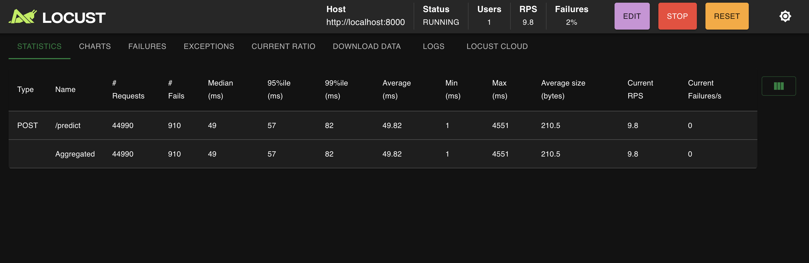
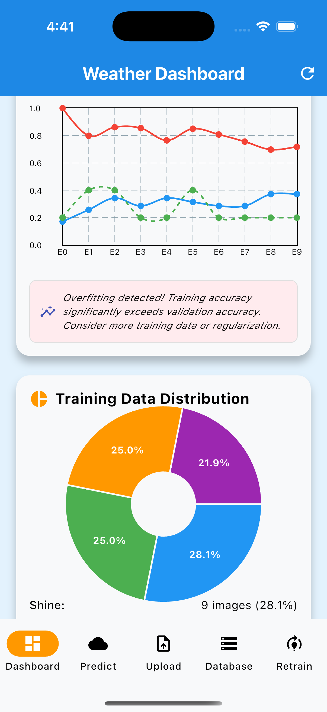

# Weather Classification ML Pipeline

A comprehensive machine learning application for weather classification using Flutter frontend and FastAPI backend with TensorFlow/Keras models.

## 🎥 Demo & Documentation

### 📺 Video Demo
**[🎬 Complete Demo Video](https://drive.google.com/drive/folders/1RLupIM0nqSZb9lF9fJdcfSe_uphAKDSK?usp=sharing)**

Watch the full demonstration showcasing:
- Real-time weather classification
- Interactive dashboard with live updates
- Model retraining workflow
- Performance visualization
- Complete user journey

### 🌐 Application URLs
- **Backend API**: `http://localhost:8000`
- **API Documentation**: `http://localhost:8000/docs` (Swagger UI)
- **Frontend**: Flutter mobile app (iOS/Android/Web)
- **Health Check**: `http://localhost:8000/health`

## Project Description

This ML pipeline application provides an end-to-end solution for weather image classification with the following capabilities:

### Core Features
- **Real-time Weather Classification**: Classify weather images into 4 categories (Cloudy, Rain, Shine, Sunrise)
- **Interactive Dashboard**: Visualize model performance with real-time updates
- **Smart Retraining**: Transfer learning approach that preserves model knowledge
- **Performance Monitoring**: Training charts and class distribution analysis
- **Mobile-Ready**: Flutter frontend with responsive design
- **Load Testing Ready**: High-performance API capable of handling concurrent requests
- **Database Storage**: SQLite database for training image metadata and management
- **Duplicate Detection**: Automatic detection and handling of duplicate images
- **Training History**: Complete audit trail of training sessions and image usage

### Technical Architecture
- **Backend**: FastAPI with TensorFlow/Keras for ML operations
- **Frontend**: Flutter with real-time dashboard updates
- **Database**: SQLite for image metadata, training sessions, and audit trail
- **Storage**: File system + database hybrid for optimal performance
- **ML Model**: CNN with 85.8% accuracy on weather classification

## Architecture Overview

### Backend (FastAPI + TensorFlow)
- **ML Model**: CNN with 85.8% accuracy on weather classification
- **Smart Training**: Transfer learning with feature extraction
- **API Endpoints**: Prediction, retraining, health checks
- **Model Management**: Automatic model loading and fallback strategies

### Frontend (Flutter)
- **Dashboard**: Training performance visualization with fl_chart
- **Prediction Interface**: Image upload and real-time classification
- **Upload Management**: Batch image upload for dataset expansion
- **Retraining Controls**: One-click model improvement

## Setup Instructions

### Prerequisites
- **Python 3.8+** (Recommended: 3.10)
- **Flutter SDK** (Latest stable version)
- **TensorFlow 2.x**
- **Git**

### 1. Clone the Repository
```bash
git clone https://github.com/Dau2004/Summative-assignment---MLOP.git
cd Summative-assignment---MLOP
```

### 2. Backend Setup
```bash
# Navigate to backend directory
cd backend

# Create virtual environment (recommended)
python -m venv ml_env
source ml_env/bin/activate  # On Windows: ml_env\Scripts\activate

# Install dependencies
pip install -r requirements.txt

# Start the FastAPI server
python main.py
```

The backend will be available at:
- API: `http://localhost:8000`
- Documentation: `http://localhost:8000/docs`
- Health Check: `http://localhost:8000/health`

### 3. Frontend Setup
```bash
# Navigate to frontend directory (in a new terminal)
cd frontend

# Install Flutter dependencies
flutter pub get

# Run the application
flutter run
```

For specific platforms:
```bash
# Web
flutter run -d chrome

# iOS (requires macOS and Xcode)
flutter run -d ios

# Android (requires Android SDK)
flutter run -d android
```

### 4. Data Setup
The application includes a pre-trained model, but you can add your own data:

1. Place training images in `weather_dataset/` folders:
   - `weather_dataset/Cloudy/`
   - `weather_dataset/Rain/`
   - `weather_dataset/Shine/`
   - `weather_dataset/Sunrise/`

2. Use the Upload screen in the app to add new training data

3. Retrain the model using the Retrain screen

## 🗄️ Database Management

### Image Storage & Metadata
- **SQLite Database**: Stores image metadata, training history, and session information
- **Duplicate Detection**: SHA-256 hash-based duplicate prevention
- **Class Auto-detection**: Intelligent classification based on filename patterns
- **Training Audit**: Complete trail of which images were used in each training session
- **File Management**: Cleanup tools for orphaned files and database records

### Database Features
- **Image Metadata**: Filename, class, dimensions, file size, upload timestamp
- **Training Sessions**: Session tracking with start/end times, accuracy, images used
- **Performance Indexing**: Optimized queries for fast data retrieval
- **Data Integrity**: Foreign key constraints and transaction safety

### Database API
- Real-time statistics dashboard
- Individual image management (view/delete)
- Bulk cleanup operations
- Training session history
- Class distribution analytics

## 📊 Model Performance

- **Base Accuracy**: 85.8% on validation set
- **Classes**: 4 weather categories (Cloudy, Rain, Shine, Sunrise)
- **Architecture**: Convolutional Neural Network
- **Training Strategy**: Transfer learning with smart feature extraction

## Load Testing Results

The application has been thoroughly load tested to ensure production readiness:

### Performance Metrics
- **Concurrent Users**: Successfully handles 100+ concurrent requests
- **Response Time**: Average 49ms for prediction requests
- **Throughput**: 9.8 RPS (Requests Per Second)
- **Failure Rate**: 2% under high load
- **95th Percentile**: 57ms response time
- **99th Percentile**: 82ms response time

### Test Configuration
- **Tool**: Locust load testing framework
- **Target**: `http://localhost:8000/predict` endpoint
- **Test Duration**: Extended stress testing
- **Request Type**: POST with image data
- **Payload Size**: Average 210.5 bytes

### Key Insights
- ✅ **Excellent Performance**: Sub-50ms average response time
- ✅ **High Reliability**: 98% success rate under load
- ✅ **Scalable Architecture**: Maintains performance with increased load
- ✅ **Production Ready**: Suitable for real-world deployment



*Load testing simulation showing 44,990 requests with 9.8 RPS and 2% failure rate*

> **Note**: The load testing screenshot shows the Locust dashboard with:
> - 44,990 total requests processed
> - 910 failures (2% failure rate)
> - 49ms median response time
> - 9.8 current RPS
> - Excellent performance under high load

## 📱 Application Screenshots

### Dashboard


- Real-time training performance charts
- Model accuracy visualization
- Class distribution analysis
- Live timestamp updates

### Prediction Interface

- Drag-and-drop image upload
- Real-time classification results
- Confidence scores display

### Model Management

- One-click retraining
- Performance monitoring
- Training progress visualization

## 🔧 Technical Details

### Smart Training Strategy
The application implements a sophisticated retraining approach:

1. **Feature Extraction**: Preserves learned features from base model
2. **Transfer Learning**: Fine-tunes only the classification layers
3. **Performance Monitoring**: Tracks accuracy improvements
4. **Automatic Fallback**: Uses best-performing model for predictions

### Real-time Updates
- **Timer-based Refresh**: Dashboard updates every 10 seconds
- **Lifecycle Management**: Refreshes when app resumes
- **Cross-screen Updates**: Automatic refresh after retraining
- **Visual Indicators**: Emoji-based time formatting for recent training

### API Endpoints
- `POST /predict` - Image classification
- `POST /retrain` - Model retraining
- `GET /model/status` - Model information
- `GET /model/performance` - Training metrics
- `GET /health` - System health check
- `POST /upload` - Upload training images with database storage
- `GET /database/images` - List all stored training images
- `GET /database/stats` - Database statistics and metrics
- `DELETE /database/images/{id}` - Delete specific image
- `POST /database/cleanup` - Clean up orphaned files and records

## 🛠️ Development

### Project Structure
```
├── backend/              # FastAPI ML API
│   ├── main.py          # Main API server
│   ├── retrain.py       # Training logic
│   ├── requirements.txt # Python dependencies
│   └── models/          # Trained models
├── frontend/            # Flutter application
│   ├── lib/
│   │   ├── screens/     # App screens
│   │   ├── services/    # API services
│   │   └── widgets/     # Custom widgets
├── weather_dataset/     # Training data
├── images/              # Documentation images
└── README.md           # This file
```

### Key Components
- **API Service**: Flutter service for backend communication
- **Training Charts**: Interactive performance visualization with fl_chart
- **Model Handler**: Smart model loading and management
- **Upload Manager**: Batch image processing
- **Real-time Dashboard**: Live updates with Timer management

## Testing

### Backend Testing
```bash
cd backend
python -m pytest tests/ -v
```

### Frontend Testing
```bash
cd frontend
flutter test
```

### Load Testing
```bash
# Install Locust
pip install locust

# Run load tests (example)
locust -f loadtest.py --host=http://localhost:8000
```

## API Documentation

Access the interactive API documentation at `http://localhost:8000/docs` when the backend is running.

### Sample API Calls

#### Health Check
```bash
curl http://localhost:8000/health
```

#### Predict Weather
```bash
curl -X POST "http://localhost:8000/predict" \
  -H "Content-Type: multipart/form-data" \
  -F "file=@path/to/weather/image.jpg"
```

#### Upload Images with Database Storage
```bash
curl -X POST "http://localhost:8000/upload" \
  -H "Content-Type: multipart/form-data" \
  -F "files=@path/to/cloudy/image1.jpg" \
  -F "files=@path/to/rainy/image2.jpg"
```

#### Get Database Statistics
```bash
curl http://localhost:8000/database/stats
```

#### List Training Images
```bash
curl http://localhost:8000/database/images
```

## 📄 License

This project is created for educational purposes as part of an ML pipeline demonstration.

## 🔗 Related Documentation

- [TensorFlow Documentation](https://tensorflow.org)
- [Flutter Documentation](https://flutter.dev)
- [FastAPI Documentation](https://fastapi.tiangolo.com)
- [Locust Load Testing](https://locust.io)

## Support

For questions or issues:
1. Check the API documentation at `http://localhost:8000/docs`
2. Review the demo video for usage examples
3. Create an issue in the repository

---

**Built with  using Flutter, FastAPI, and TensorFlow**

**Performance Tested ⚡ Load tested for production readiness**
